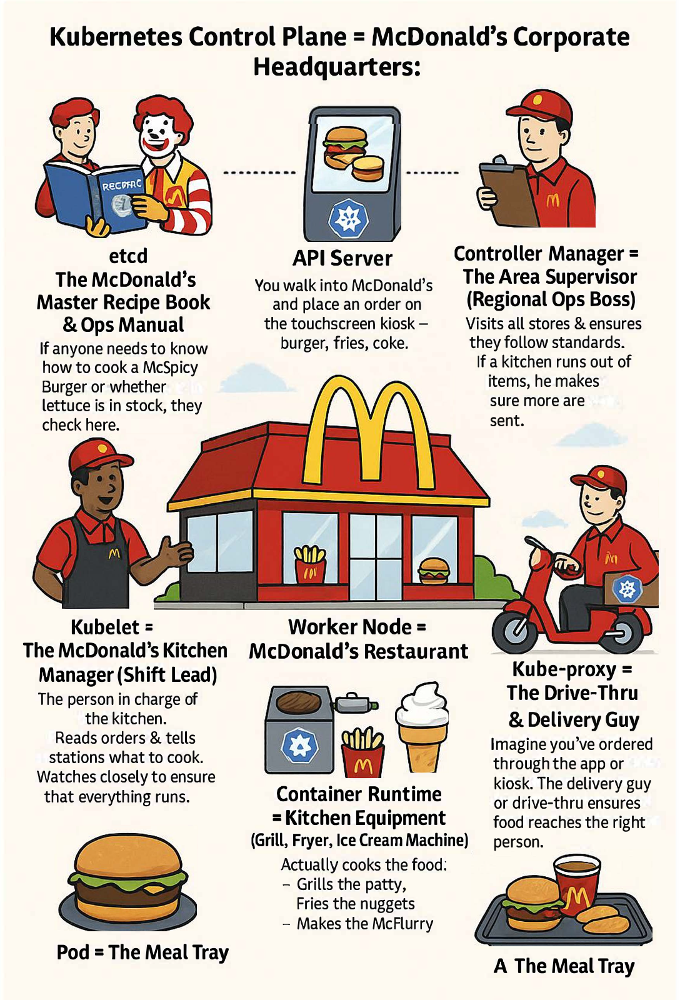

# Kubernetes--02-Components

**An overview of the key components that make up a Kubernetes cluster.**

Here I'm going to explain a high-level overview of the essential components that make up a Kubernetes cluster.

> Imagine, We are managing Hardcastle Restaurants Pvt. Ltd. (HRPL) who owns & operates McDonald's restaurants across West and South India. 

# Kubernetes as McDonald's: The Fast-Food Restaurant.
**Imagine Kubernetes as the system that runs hundreds of McDonald’s outlets smoothly, automatically, and consistently.**

Let’s break it down:

## Kubernetes Control Plane = McDonald’s Corporate HQ
Think of this as the head office that runs the show across all McDonald’s outlets.
It doesn't make burgers directly, but it tells every store what to cook, how to cook it, and makes sure nothing goes off-track.

### 1. API Server = The TouchScreen Kiosk (Front Counter)
- We walk into McDonald's and place an order on the touchscreen kiosk – burger, fries, coke.
- That kiosk doesn’t cook the food, but it captures our request and sends it to the kitchen.
- It’s also where every single instruction goes through — nothing reaches the kitchen without passing through here.

> In Kubernetes, The API Server is like the main entrance. It's the core component that exposes the Kubernetes HTTP API, and every tool — kubectl, dashboards, or automation scripts — talks to the cluster through this gate.

### 2. `etcd` = McDonald's Master Recipe Book and Operations Manual
- This is the **official operations manual** — the source of truth for everything.
- It has:
    - The menu.
    - The cooking instructions.
    - The inventory data.
    - The status of every outlet.
- If anyone needs to know how to cook a McSpicy Chicken Burger or whether lettuce is in stock, they need to check here.
> In Kubernetes, `etcd` is the brain of the system — a reliable, distributed **key-value store** that holds **cluster state, configs, node info, and secrets.** Everything the API Server knows, it saves here.

### 3. Scheduler = The Order Dispatcher (Back-Kitchen Manager)
Imagine someone behind the scenes watching which station (grill, fryer, drinks) is free or busy.
- When our order goes in, the scheduler decides:
    - “Let’s send this burger to Grill Station 2 — they’re available and have enough cheese.”
- It ensures the fastest and most efficient delivery by assigning orders to the less-busy kitchen station **(Node)** with enough resources.
>  The Scheduler finds the best **Node** for a new **Pod** to run, based on CPU, memory, and other constraints.

### 4. Controller Manager = Area Supervisor (Regional Ops Boss)
- Like an Area supervisor, this guy visits all the stores and ensures that every McD outlet follows the standards.
- If a Kitchen runs out of cheese or Lettuce - He makes sure more are sent.
- He's constantly checking to ensure **reality matches the plan**.
> In Kubernetes, The Controller Manager ensures the cluster self-heals — if a Pod crashes, it brings it back. It constantly checks if the actual state matches the desired state, and takes action when they drift.

## Worker Node = Individual McDonald’s Branch
Each Restaurant (Node) has it's own mini Teams and Machines. This is where the Actual cooking (running our Apps) happens.

### 5. Kubelet = The McD's Kitchen Manager (Shift Lead)
Imagine the Kubelet as the person in charge of the kitchen at each McDonald's outlet.
- They read the orders from headquarters (API Server).
- They assign tasks to the right equipment — “grill this patty,” “fry those nuggets.”
- They watch the kitchen closely to ensure everything is running — no fries burning, no burgers forgotten.

If something breaks (like the fryer stops working) or an order is dropped, the manager raises an alert or takes action to fix it.
> In Kubernetes, The **Kubelet** is the on-site agent that talks to the control plane, makes sure containers (our apps) are running properly in Pods, and reports health and status back to the system.

### 6. Container Runtime = The Kitchen Equipment (Grill, Fryer, Ice Cream Machine)
Imagine the container runtime as the actual Kitchen Equipment inside the McD's kitchen.
- The Grill sears our Burger patty.
- The Fryer cooks the fries to golden perfection.
- The Ice-Cream Machine whips up our McFlurry.

The staff (Kubelet) tells these machines what to make, but the machines are the ones that physically cook the food.

> In K8s, The **container runtime** (like Docker or containerd) actually runs our application container, just like these machines cook food based on instructions. Without it, nothing gets made.

### 7. Kube-proxy = The Drive-Thru and Delivery Guy
- Imagine I've ordered through the McD's app or Kiosk. The Delivery guy or the drive-thru lane makes sure our meal reaches the right person.
- It knows where to send the burger, whether it's **to Table 19, car window #3 or my home**.
- It also manages traffic, ensure no order gets lost or is misdelivered.
> In k8s, Kube-proxy acts as the **Traffic Router**. It handles **network rules**, forward traffic to the right Pod and ensures our request reaches the app - whether we're calling it from inside the cluster or the outside world.

### 8. Pod = The Meal Tray
- When our food is ready, it is served on a tray.
- The tray might have just one item (a burger), or it might have a combo (burger + fries + coke).
- All these items belong together and are **delivered as a single unit.**
> In K8s, A **Pod** is the smallest deployable unit. It wraps one ore more containers (our apps) which **share the same IP, storage and lifecycle** - just like items on the same tray are part of one meal.

