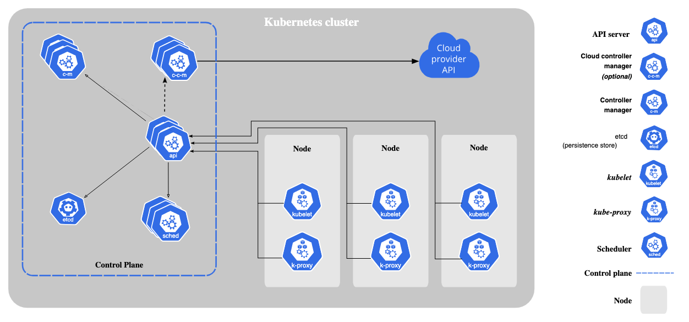

# Kubernetes--02-Components

## Kubernetes Components

**An overview of the key components that make up a Kubernetes cluster.**

Here I'm going to explain a high-level overview of the essential components that make up a Kubernetes cluster.
Let’s break down the core components of Kubernetes in a simple way — imagine you are managing a restaurant kitchen

# Kubernetes as McDonald's: The Fast-Food Restaurant.
**Imagine Kubernetes as the system that runs hundreds of McDonald’s outlets (like your apps) smoothly, automatically, and consistently.**

Let’s break it down:

## Kubernetes Control Plane = McDonald’s Corporate HQ
These are the people and systems that run all the stores and ensures that everything happens as planned.

### 1. API Server = The Order Counter (TouchScreen Kiosk)
- This is where customers place their orders like Burgers, Fries, Cokes etc.
- We tell McDonald's what we want.
- All requests go through here first.

> In Kubernetes, this is the entry point for all commands (kubectl, dashboards, automation tools etc ). It is the core component server that exposes the Kubernetes HTTP API.

### 2. etcd = McDonald's recipe and Operations Manual
- It stores everything like Menu, Cooking Steps, Stock Levels, Store Statuses.
- It's the **source of truth** for how every item should be made.
> In Kubernetes, `etcd` stores Cluster State, Config, Nodes and Secrets. Consistent and highly-available key value store for all API server data.

### 3. Scheduler = Kitchen Manager
- Looks at all the kitchen stations and decides where to prepare our burger.
- Finds the best, less-busy kitchen station **(Node)** with enough resources.
> In Kubernets, Scheduler assigns new **Pod**s to the Right **Node**

### 4. Controller Manager = Area Supervisor
- Like an Area supervisor who ensures that 